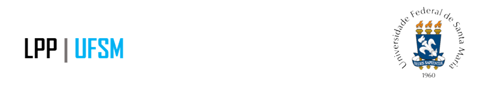

layout: true

background-image: url(imagens/marcadagua.png)
background-size: cover

```{r setup, include=FALSE}
options(htmltools.dir.version = FALSE)
```

```{css echo=FALSE}
.hide-count .remark-slide-number {
  display: none;
}

.small {
  font-size: 60%;}
}
```

---
class: center, middle, hide-count

```{r, echo=FALSE}

```


# Certificado

Certificamos que **NOME** compareceu ao evento "**Workshop: Análise de Dados Brasileiros com R**", apresentado pela Liga de Políticas Públicas da Universidade Federal de Santa Maria no dia 08 de junho de 2021, totalizando uma carga horária de 5 horas.
<br />
<br />

.pull-left[
```{r, echo=FALSE, fig.align='center', out.width='59%'}
knitr::include_graphics("imagens/assinatura1.png")
```
Gabriela Terra<br />.small[Organizadora]]

.pull-right[
```{r, echo=FALSE, fig.align='center', out.width='65%'}
knitr::include_graphics("imagens/assinatura2.png")
```
<br />Mateus Cardoso<br />.small[Organizador]]

<br />
<br />
<br />
<br />
--

